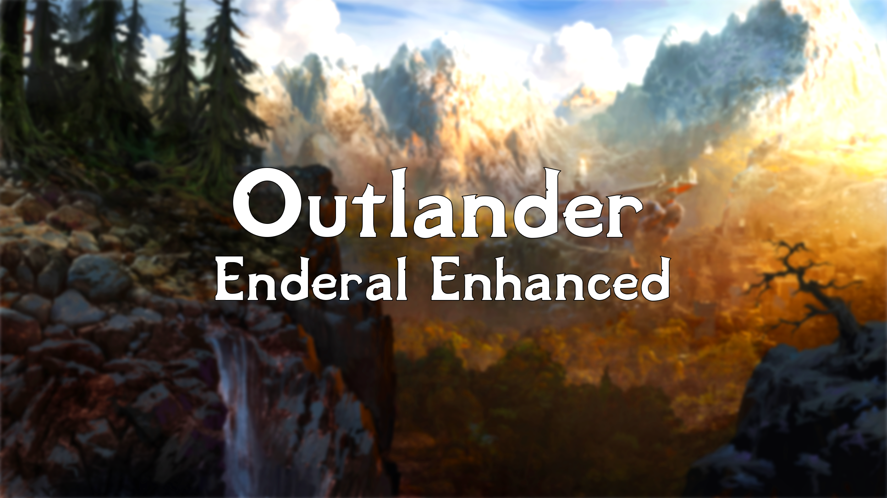

<a href="#"></a>

---

<p align="center">
  <a href="https://www.nexusmods.com/enderalspecialedition/mods/389">Nexus Page</a> ·
  <a href="README.md">Installation</a> ·
  <a href="GAMEPLAY.md">Gameplay Guide</a> ·
  <a href="CONFIGURATION.md">Configuration</a> ·
  <a href="CHANGELOG.md">Changelog</a> ·
  <a href="HELP.md">Help</a>
</p>

---

# Configuration

- [Configuration](#configuration)
  - [Optional Content](#optional-content)
    - [Widescreen](#widescreen)
    - [Character Presets](#character-presets)
    - [General Rules](#general-rules)
  - [Mod Configuration](#mod-configuration)
    - [MCM Menus](#mcm-menus)
  - [Performance Guide](#performance-guide)

## Optional Content
When enabling any optional files, make sure they are always loaded BEFORE watercolor.esp in your load order. See the alternate start section for an example of this.

**As a warning. The optional content has not been tested nearly as heavily as the rest of the list as not everyone has it enabled. Support will be limited if you enable any of the optional content as its more difficult to account for them. If you are at all worried about stability, do NOT enable any.**

### Widescreen

I have included the necessary mods to enable widescreen UI support. If you play on a widescreen monitor, this can be enabled in the optional mods section.


Also, if you are using the optional NordicUI, enable the mod entitled "NORDIC UI - Ultrawide Fixes and Patches".

### Character Presets

Outlander includes mod that contains a few character presets, and you can also copy presets you download from the [Outlander Character Presets Discord thread](https://discord.com/channels/773659452392865792/952965520083275796) to load when creating new characters. 

The presets mod is here:


You can select this mod, right-click it, and then select "Open in Explorer" to see the presets directory, which will be at this location:

```
Outlander\mods[NoDelete] Character Presets\SKSE\Plugins\CharGen\Presets
```

### General Rules
When enabling this content, just like with alternate start mods, ensure all mod esp files are just above realisticwatertwo.esp in your load order and if there is a Outlander patch for them, load that after the mod's esp and above all other Outlander patches. This applies for any optional content not specifically mentioned here. For content with its own section, follow the appropriate readme section for it.

## Mod Configuration

### MCM Menus

All MCM menus have been automated so you are good to ignore them unless you want to change anything.

## Performance Guide

- Try turning off ENB under ENB Options
