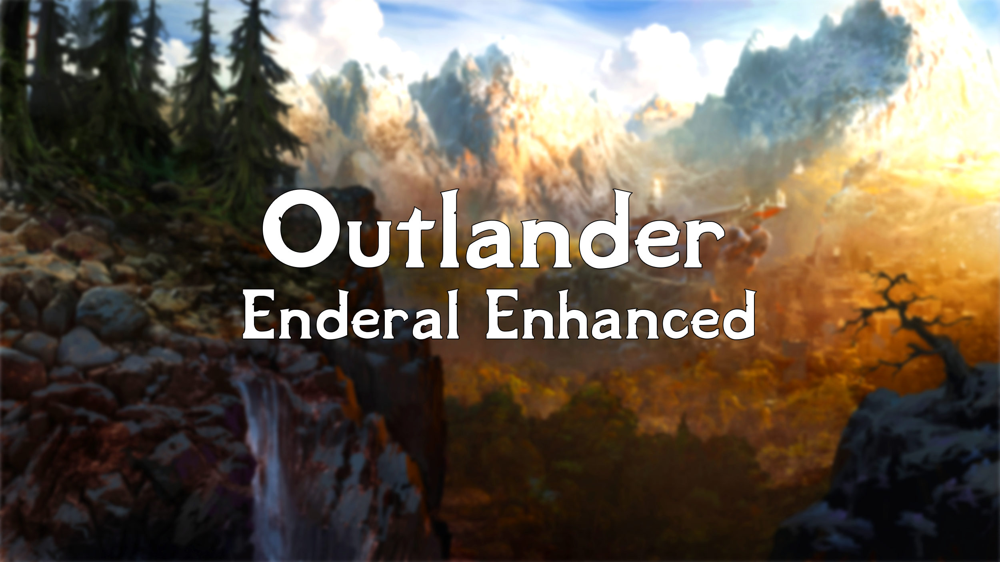

---

  <a href="https://www.nexusmods.com/enderalspecialedition/mods/389">Nexus Page</a> ·
  <a href="README.md">Installation</a> ·
  <a href="GAMEPLAY.md">Gameplay Guide</a> ·
  <a href="CONFIGURATION.md">Configuration</a> ·
  <a href="CHANGELOG.md">Changelog</a> ·
  <a href="HELP.md">Help</a>

---

# Gameplay Guide

> :ledger: **IMPORTANT NOTE: This gameplay guide reflects The Path 1.0.0 version. Guides for previous versions may be found by clicking the History button in the upper left corner of this page.**

## Overview

This guide highlights major mods included in The Path in the following categories:

- [Hotkeys](#hotkeys)
- [Quick Start](#quick-start)
- [Gameplay](#remastered-gameplay)
- [User Interface and Camera](#user-interface-and-camera)
- [Combat](#combat)
- [Character Builds](#character-builds)
- [Immersion](#immersion)
- [Quality of Life](#quality-of-life)
- [Gear](#gear)
- [Followers and Companions](#followers-and-companions)
- [Homes](#homes)
- [Quests](#quests)
- [Quest Timing](#quest-timing)
- [Enemies](#enemies)
- [Locations](#locations)

Icons in this guide:

- :new: indicates additions to the gameplay guide since the last major release
- :ledger: indicates Septimus configuration notes
- :video_game: indicates Septimus play testing observations

## Hotkeys

### Gameplay Hotkeys

- <kbd>C</kbd> - Switches shoulders for [SmoothCam](https://www.nexusmods.com/skyrimspecialedition/mods/41252)

- <kbd>E</kbd> - Use selected item in inventory, create item while crafting, or take item while browsing container

  - <kbd>E</kbd> while selecting a broom from inventory, organizes clutter via [Sweeping Organizes Stuff](https://www.nexusmods.com/skyrimspecialedition/mods/51645)

  - <kbd>E</kbd> while selecting an instrument (drum, flute, lute) from inventory in a tavern, plays instrument via [Skyrim's Got Talent - Improve As a Bard](https://www.nexusmods.com/skyrimspecialedition/mods/50357)

  - <kbd>E</kbd> while selecting a shovel from inventory, buries dead bodies via [Shovels Bury Bodies](https://www.nexusmods.com/skyrimspecialedition/mods/52984)

- <kbd>F</kbd> - In inventory, favorite selected item

- <kbd>H</kbd> - Access mount's saddlebags, make mounts follow or wait (even if you fast travel), call your mount, or give your current mount to a follower using [Simplest Horses](https://www.nexusmods.com/skyrimspecialedition/mods/54225)

- <kbd>L</kbd> - Toggles lantern, provided you've crafted and equipped a [Simple Wearable Lantern](https://www.nexusmods.com/skyrimspecialedition/mods/58464)

- <kbd>R</kbd> - Drop selected item in inventory, or take all items from container

- <kbd>Q</kbd> - Opens up [SkyUI](https://www.nexusmods.com/skyrimspecialedition/mods/12604) favorites menu

- <kbd>X</kbd> - Toggles compass visibility

- <kbd>CTRL</kbd> - Toggles sneaking (without weapons drawn) or performs dodge (with weapons drawn) using [The Ultimate Dodge Mod Reborn](https://www.nexusmods.com/skyrimspecialedition/mods/63000)

- <kbd>SHIFT</kbd> - Toggles sprinting

- <kbd>Middle Mouse Button</kbd> - Locks on to enemies in [True Directional Movement](https://www.nexusmods.com/skyrimspecialedition/mods/51614)

- <kbd>Middle Mouse Wheel</kbd> - Switches targets in [True Directional Movement](https://www.nexusmods.com/skyrimspecialedition/mods/51614)

### ENB Hotkeys

- <kbd>F7</kbd> - Toggles FPS visibility, provided you are using ENB

- <kbd>F10</kbd> - Toggles ENB on/off

- <kbd>F11</kbd> - Toggles ENB configuration, provided you are using ENB

### Immersive Equipment Displays Hotkey

- <kbd>SHIFT</kbd> + <kbd>PAGE DOWN</kbd> - Opens [Immersive Equipment Displays](https://www.nexusmods.com/skyrimspecialedition/mods/62001?tab=description) configuration menu

## User Interface and Camera

Septimus includes a minimalistic and modern UI, featuring:

- [Dynamic Things Alternative](https://www.nexusmods.com/skyrimspecialedition/mods/49250) - Interact with previously static items like archery targets, crates, mammoth skulls, taproots, and more

- [RaceMenu](https://www.nexusmods.com/skyrimspecialedition/mods/19080) - Complete overhaul to the character creation menu including new customization features

- [SkyUI](https://www.nexusmods.com/skyrimspecialedition/mods/12604) - Elegant, PC-friendly interface

- [SmoothCam](https://www.nexusmods.com/skyrimspecialedition/mods/41252) - SmoothCam is a highly configurable third-person camera, with smooth frame-interpolation and a raycasting crosshair to help you aim.

  > :ledger: By default, the [Modern Camera](https://www.nexusmods.com/skyrimspecialedition/mods/41636) preset is included but you're free to try another preset

- [True Directional Movement](https://www.nexusmods.com/skyrimspecialedition/mods/51614) - Overhauls the third person gameplay similar to modern action RPGs. Move and attack in any direction

  > :ledger: By default, use the <kbd>Middle Mouse Button</kbd> to lock on to enemies and the <kbd>Middle Mouse Wheel</kbd> to switch targets.

- [TrueHUD](https://www.nexusmods.com/skyrimspecialedition/mods/62775) - Customizable actor info bars, boss bars, and player widget

## Combat

Septimus includes combat overhauls to increase the game's difficulty and encourage resource management:

- [Blade and Blunt](https://www.nexusmods.com/skyrimspecialedition/mods/34549) - A lightweight combat enhancement which makes combat more engaging

- [The Ultimate Dodge Mod Reborn](https://www.nexusmods.com/skyrimspecialedition/mods/63000) - <kbd>CTRL</kbd> performs dodge (with weapons drawn)

## Character Builds

Consider the following mods when planning character builds in Septimus:

### Magic

TBD

## Quality of Life

Septimus includes quality-of-life improvements to streamline your playing experience, featuring:

- [Forget Spell](https://www.nexusmods.com/skyrimspecialedition/mods/51125) - Too many spells cluttering your magic menu? Now you can forget them, directly from the menu!

- [Essential Favorites](https://www.nexusmods.com/skyrimspecialedition/mods/42997) - Prevents favorited items from being sold, crafted, disarmed, disenchanted, or dropped

- [Stay at the System Page](https://www.nexusmods.com/skyrimspecialedition/mods/19832) - Ensures the journal menu always opens at the system page tab

## Gear

### New Gear

In addition to the new gear and equipment available in the AE Creation Club, Septimus adds carefully balanced and lore-friendly items, including:

- [Cloaks and Capes](https://www.nexusmods.com/skyrimspecialedition/mods/2019) - This mod adds the craftable 'Fur Cloak' and 'Linen Cape' to the game of Skyrim

- [Sforzinda Fashions of the Fourth Era](https://sforzmods.tumblr.com/sse_fashions) - Attempts to bring sartorial diversity and a more organic look into the world of Skyrim through adding new clothes, armours, and accessories based on vanilla items. Now Nazeem can annoy you in a different outfit every new save you start, joy of joys!

- [Simple Wearable Lanterns](https://www.nexusmods.com/skyrimspecialedition/mods/58464) - Adds three brand new wearable lanterns

  > :ledger: Craft your choice of lantern. Once crafted and equipped, pressing the <kbd>L</kbd> key toggles the lantern.
